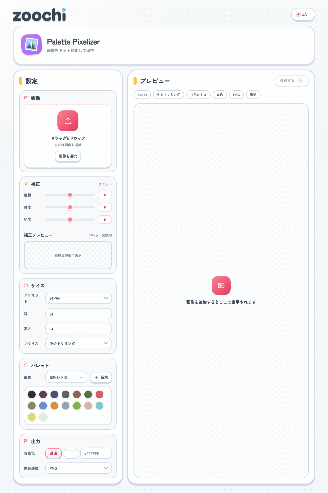
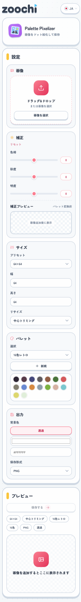

# Palette Pixelizer 画面仕様

## 1. 対象画面

- 画面名: `Palette Pixelizer`
- 用途: 画像をドット絵風に変換し、指定サイズとパレットで保存する
- 記録対象: 公開ページのデスクトップ表示とモバイル表示

## 2. スクリーンショット

### デスクトップ

### モバイル

## 3. 画面全体の構成

### ヘッダー

- 左上に `zoochi` ロゴを配置し、トップページへ戻れる
- 右上に 6 言語対応の言語プルダウンを配置する
- その下にアプリアイコン、アプリ名、概要を並べたヘッダーカードを置く

### メインエリア

- デスクトップでは左に設定、右にプレビューを置く 2 カラム構成
- モバイルでは設定セクションを上から順に並べ、その下にプレビューを置く

## 4. 画面要素

### 4-1. 設定

- 見出し `設定`
- `画像`
  - ドラッグ&ドロップで画像を追加する
  - ボタンからファイル選択もできる
  - 画像追加後はファイル名、元画像サイズ、削除ボタンを表示する
- `補正`
  - `色相`
  - `彩度`
  - `明度`
  - 各項目はスライダーと数値表示を持つ
  - `補正プレビュー` でパレット変換前の状態を確認できる
  - `リセット` で補正値を初期化する
- `サイズ`
  - `プリセット`
  - `幅`
  - `高さ`
  - `リサイズ`
  - 出力サイズと画像の収め方を決める
- `パレット`
  - プリセットとカスタムの選択 UI
  - `新規` ボタンで現在の色からカスタムパレットを作る
  - 選択中の色をカラーチップで一覧表示する
  - カスタムパレット時は名前変更、色追加、色削除、パレット削除ができる
- `出力`
  - `背景色`
    - `透過` ボタン
    - カラーピッカー
    - HEX 入力
  - `保存形式`
    - `PNG / JPEG / WebP`
  - 透過を含む非 PNG 保存時は注意文を表示する

### 4-2. プレビュー

- 見出し `プレビュー`
- 右上の保存ボタン
- メタ情報ピル
  - 出力サイズ
  - リサイズ方法
  - 選択パレット名
  - 色数
  - 保存形式
  - 背景色または透過
- プレビューキャンバス
  - 空状態では案内アイコンとメッセージを表示する
  - 画像追加後はドット絵化した結果を表示する

## 5. 主な状態

### 初期状態

- 画像未追加
- 補正プレビューと本プレビューは空状態
- 保存ボタンは無効

### 編集中

- 補正値、サイズ、パレット、背景色の変更を即座にプレビューへ反映する
- カスタムパレットを編集すると色チップと出力結果が更新される

### 保存時

- 画像がある場合のみ保存できる
- 保存ファイル名には元画像名、パレット、出力サイズ、拡張子を反映する

## 6. レスポンシブ方針

- デスクトップでは設定と結果を並べて比較しやすくする
- モバイルでは操作順に沿って `画像 → 補正 → サイズ → パレット → 出力 → プレビュー` の順で積む
- セレクト、数値入力、色入力は狭い幅でも崩れないよう 1 カラム前提で整える
